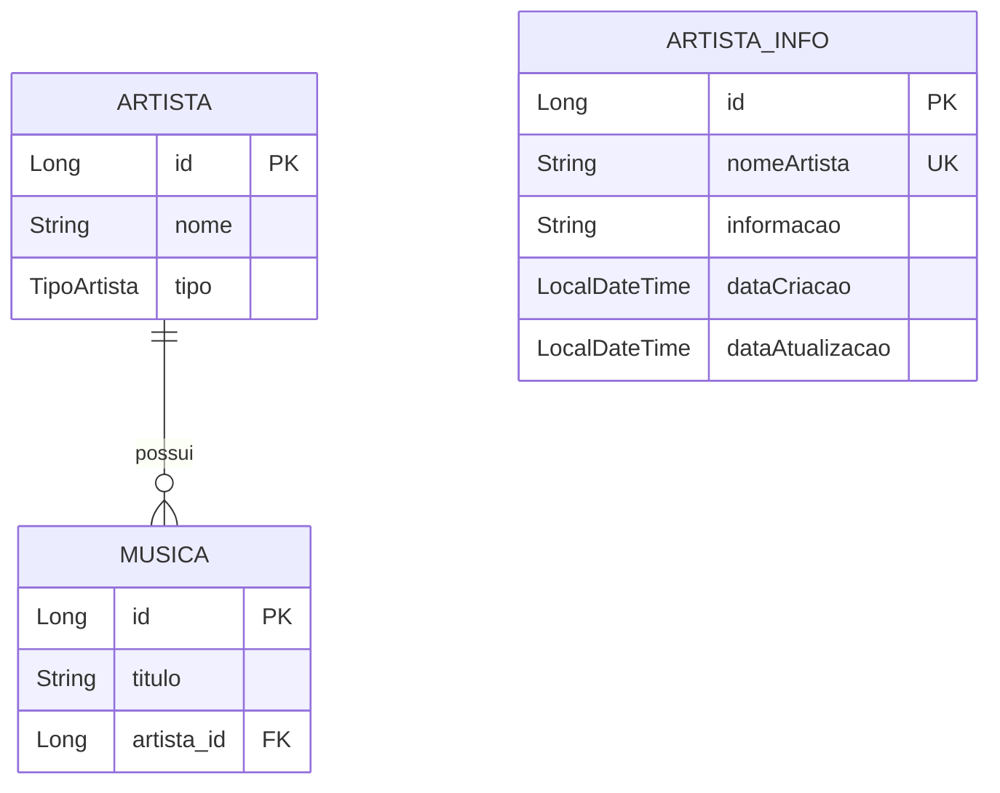

# 🎵 ScreenSound

> Sistema de gerenciamento de artistas e músicas com integração à API Google Gemini


---

## 📋 Sobre o Projeto

**ScreenSound** é uma aplicação de linha de comando desenvolvida para fins acadêmicos, focada no aprendizado de:

- ✅ Spring Boot & Spring Data JPA
- ✅ Integração com APIs REST (Google Gemini AI)
- ✅ Persistência de dados com PostgreSQL
- ✅ Padrões de projeto (Repository, Service, Dependency Injection)
- ✅ Sistema de cache inteligente para economia de API

---

## 🚀 Funcionalidades

| Funcionalidade | Descrição |
|----------------|-----------|
| 📝 **Cadastrar Artistas** | Registre artistas com nome e tipo (solo, dupla, banda) |
| 🎼 **Cadastrar Músicas** | Adicione músicas vinculadas a artistas cadastrados |
| 📋 **Listar Músicas** | Visualize todos os artistas e suas músicas |
| 🔍 **Buscar por Artista** | Encontre músicas de um artista específico |
| 🤖 **Pesquisa Inteligente** | Consulte informações sobre artistas via Google Gemini AI |
| 💾 **Cache Automático** | Sistema inteligente que evita consultas duplicadas à API |

---

## 🛠️ Tecnologias Utilizadas

### Backend
- **Java 21** - Linguagem principal
- **Spring Boot 3.4.3** - Framework base
- **Spring Data JPA** - Persistência e ORM
- **Lombok** - Redução de boilerplate

### Banco de Dados
- **PostgreSQL** - Banco relacional
- **Hibernate** - ORM

### APIs & Serviços
- **Google Gemini AI** - Inteligência artificial generativa
- **Neon Database** - Hospedagem PostgreSQL

---

## 📦 Pré-requisitos

Antes de começar, certifique-se de ter instalado:

- ☕ **Java 21** ou superior
- 🐘 **PostgreSQL** (ou conta Neon Database)
- 🔑 **Google Gemini API Key** ([Obter aqui](https://ai.google.dev/))

---

## ⚙️ Configuração

### 1️⃣ Clone o repositório
```bash
git clone <repository-url>
cd screensound
```

### 2️⃣ Configure as variáveis de ambiente

Crie/edite seu arquivo de variáveis de ambiente:

```bash
# Banco de Dados PostgreSQL (Neon ou local)
export DB_HOST_NEON="seu-host.neon.tech"
export DB_NAME_NEON="screensound"
export DB_USER_NEON="seu-usuario"
export DB_PASS_NEON="sua-senha"

# Google Gemini API
export GEMINI_API_KEY="sua-api-key-aqui"
```

### 3️⃣ Configure o application.properties

O arquivo já está configurado em `src/main/resources/application.properties`:

```properties
# Database
spring.datasource.url=jdbc:postgresql://${DB_HOST_NEON}:5432/${DB_NAME_NEON}?sslmode=require
spring.datasource.username=${DB_USER_NEON}
spring.datasource.password=${DB_PASS_NEON}

# Gemini API
gemini.api-key=${GEMINI_API_KEY}
gemini.model=gemini-2.5-flash
```

### 4️⃣ Execute a aplicação

```bash
# Com Maven Wrapper (recomendado)
./mvnw spring-boot:run

# Ou compile e execute
./mvnw clean package
java -jar target/screensound-0.0.1-SNAPSHOT.jar
```

---

## 💻 Como Usar

Ao iniciar, você verá o menu interativo:

```
*** Screen Sound Músicas ***

1- Cadastrar artistas
2- Cadastrar músicas
3- Listar músicas
4- Buscar músicas por artistas
5- Pesquisar dados sobre um artista

9 - Sair
```

### Exemplos de Uso

**1. Cadastrar um Artista**
```
Escolha: 1
Nome: Tyler the Creator
Tipo: solo
```

**2. Cadastrar uma Música**
```
Escolha: 2
Artista: Tyler
Nome da música: EARFQUAKE
```

**3. Pesquisar Informações (com cache)**
```
Escolha: 5
Artista: Tyler the Creator

🌐 Consultando API Gemini...  (primeira vez)
ℹ️ Informação recuperada do cache  (próximas vezes - 0 custo!)
```

---

## 🏗️ Arquitetura do Projeto

```
src/main/java/com/screensound/screensound/
├── model/
│   ├── Artista.java           # Entidade artista
│   ├── Musica.java            # Entidade música
│   ├── TipoArtista.java       # Enum (SOLO, DUPLA, BANDA)
│   └── ArtistaInfo.java       # Entidade de cache
├── repository/
│   ├── ArtistaRepository.java      # CRUD de artistas
│   └── ArtistaInfoRepository.java  # Cache de consultas
├── service/
│   └── ConsultaGemini.java    # Integração com Gemini AI
├── principal/
│   └── Principal.java         # Menu e lógica de interação
└── ScreensoundApplication.java # Entry point
```

### Padrões Implementados

- 🏛️ **Repository Pattern** - Abstração de acesso a dados
- 🔧 **Service Layer** - Lógica de negócio isolada
- 💉 **Dependency Injection** - Injeção via construtor
- 💾 **Cache Pattern** - Redução de chamadas à API
- 🔒 **Immutability** - Campos `final` onde aplicável

---

## 🎨 Destaques Técnicos

### 1. Sistema de Cache Inteligente
```java
// Primeira consulta: API (custo)
pesquisar("Tyler the Creator") → 🌐 Gemini API → 💾 Salva no BD

// Consultas seguintes: Cache (grátis)
pesquisar("Tyler the Creator") → 💾 Busca no BD → ⚡ Instantâneo
```

### 2. Otimização de Prompts
- Respostas limitadas a **150 palavras**
- Redução de **70-80% no consumo de tokens**
- Informações focadas e objetivas

### 3. Segurança
- ✅ Variáveis sensíveis em environment variables
- ✅ Sem credenciais hardcoded no código
- ✅ SSL habilitado no PostgreSQL
- ✅ Stack traces desabilitados em produção

---

## 📊 Modelo de Dados



---

## 🔧 Comandos Maven Úteis

```bash
# Compilar o projeto
./mvnw clean compile

# Executar testes
./mvnw test

# Gerar JAR executável
./mvnw clean package

# Executar a aplicação
./mvnw spring-boot:run

# Limpar target
./mvnw clean
```

---

## 💡 Melhorias Futuras

- [ ] Implementar expiração de cache (ex: 30 dias)
- [ ] Adicionar API REST para acesso web
- [ ] Implementar autenticação e autorização
- [ ] Criar interface web (frontend)
- [ ] Adicionar testes unitários e de integração
- [ ] Implementar paginação para grandes volumes
- [ ] Adicionar logs estruturados

---

## 📝 Licença

Este projeto está sob a licença MIT. Veja o arquivo [LICENSE](LICENSE) para mais detalhes.

---

## 👨‍💻 Autor

Desenvolvido como projeto acadêmico para prática de Spring Boot e integrações com APIs.

---

## 🙏 Agradecimentos

- [Spring Framework](https://spring.io/)
- [Google Gemini AI](https://ai.google.dev/)
- [Neon Database](https://neon.tech/)
- [Project Lombok](https://projectlombok.org/)

---

<div align="center">

**⭐ Se este projeto foi útil, considere dar uma estrela!**

</div>
